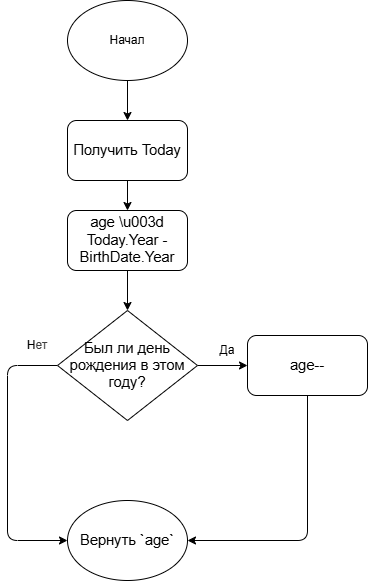

# Библиотека ClinicCore


Библиотека классов для управления данными пациентов клиники. Проект разработан в учебных целях для демонстрации **CI/CD** и **Unit-тестирования**.

## 📋 Функциональность

* Хранение данных пациента (ФИО, Дата рождения).

* Расчет точного возраста с учетом високосных годов.

## 🧠 Алгоритм работы

Логика расчета возраста реализована по следующей схеме:



## 🚀 Как использовать

Пример вызова метода расчета возраста:

```csharp

var patient \u003d new Patient

{

    FullName \u003d \"Удалов Семён\",

    BirthDate \u003d new DateTime(2026, 13, 4)

};

int age \u003d patient.CalculateAge();

Console.WriteLine($\"Возраст пациента: {age}\");
```

## 🛠 Технологии

● .NET 8.0
● xUnit
● GitHub Actions
